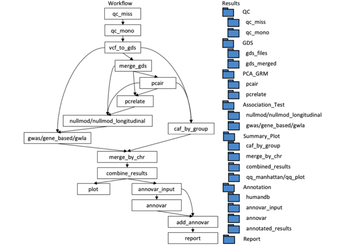

<!-- README.md is generated from README.Rmd. Please edit that file -->

# nf-gwas-pipeline

A Nextflow Genome-Wide Association Study (GWAS) Pipeline

[](https://www.nextflow.io/)

[](https://github.com/montilab/nf-gwas-pipeline/issues)

# Installation

### Clone Repository

``` bash
$ git clone https://github.com/montilab/nf-gwas-pipeline
```

### Initalize Paths to Test Data

We have provided multiple toy datasets for testing the pipeline and
ensuring all paths and dependencies are properly setup. To set the toy
data paths to your local directory, run the following script.

``` bash
$ cd nf-gwas-pipeline
$ python utils/paths.py  
```

### Download Nextflow Executable

Nextflow requires a POSIX compatible system (Linux, OS X, etc.) and Java
8 (or later, up to 11) to be installed. Once downloaded, optionally make
the nextflow file accessible by your $PATH variable so you do not have
to specify the full path to nextflow each time.

    $ curl -s https://get.nextflow.io | bash

### Quick Start with Docker

We have created a pre-built Docker image with all of the dependencies
installed. To get started, first make sure [Docker is
installed](https://docs.docker.com/get-docker/). Then pull down the
image onto your local machine.

    $ docker pull montilab/gwas:latest

#### or

Optionally you could build this image yourself from the Dockerfile which
specifies all of the dependencies required. *Note: This might take a
while!*

    $ docker build --tag montilab/gwas:latest .

### Run with docker

    $ ./nextflow gwas.nf -c gwas.config -with-docker montilab/gwas

### Expected Output

``` bash
N E X T F L O W  ~  version 19.04.1
Launching `gwas.nf` [jolly_fermi] - revision: 46311ebd05
-

G W A S  ~  P I P E L I N E

================================
indir     : <YOUR PATH>/data/
outdir    : <YOUR PATH>/results

vcf       : <YOUR PATH>/data/toy_vcf.csv
pheno     : <YOUR PATH>/data/pheno_file_logistic.csv
snpset    : <YOUR PATH>/data/snpset.txt

phenotype : outcome
covars    : age,sex,PC1,PC2,PC3,PC4
model     : logistic
test      : Score
ref       : hg19

-
[warm up] executor > local
executor >  local (141)
[60/b5b95e] process > qc_miss                   [100%] 22 of 22 ✔
[11/fa0fbd] process > annovar_ref               [100%] 1 of 1 ✔
[8f/25f8fa] process > qc_mono                   [100%] 22 of 22 ✔
[82/069a6d] process > vcf_to_gds                [100%] 22 of 22 ✔
[3e/819e86] process > merge_gds                 [100%] 1 of 1 ✔
[c3/f23390] process > nullmod_skip_pca_grm      [100%] 1 of 1 ✔
[ed/91344b] process > gwas_skip_pca_grm         [100%] 22 of 22 ✔
[b4/3aea3e] process > caf_by_group_skip_pca_grm [100%] 22 of 22 ✔
[e2/3c778d] process > merge_by_chr              [100%] 22 of 22 ✔
[fe/33ebd4] process > combine_results           [100%] 1 of 1 ✔
[8b/2020d3] process > annovar_input             [100%] 1 of 1 ✔
[61/3a373f] process > plot                      [100%] 1 of 1 ✔
[66/6f4246] process > annovar                   [100%] 1 of 1 ✔
[85/d4266b] process > add_annovar               [100%] 1 of 1 ✔
[9e/4fc2fe] process > report                    [100%] 1 of 1 ✔
Completed at: 15-Oct-2020 17:30:28
Duration    : 44.1s
CPU hours   : 0.1
Succeeded   : 141
```

### Alternative to Docker

If you are running the pipeline on a HPC that does not support docker
(BU’s Shared Computing Cluster), you can load the dependencies and run
the pipeline as follows. (In addition, you need to install following R
packages: SeqArray, GENESIS, Biobase, SeqVarTools, dplyr, SNPRelate,
ggplot2, data.table, reshape2, latex2exp, knitr, EBImage, GenomicRanges,
TxDb.Hsapiens.UCSC.hg19.knownGene, GMMAT, ezknitr)

    $ module load R/4.1.1
    $ module load vcftools/0.1.16
    $ module load bcftools/1.10.2
    $ module load plink/2.00a1LM
    $ module load annovar/2018apr
    $ module load pandoc/2.5

    nextflow gwas.nf -c gwas.config

# Underlying Structure and Output folder

<!-- -->

# Inputs and Configuration

### Mandatory Input File Formats

#### 1. Phenotype file: csv file

1.  The first column should be the unique ID for subjects
2.  Names of the columns and numbers of columns are not fixed
3.  The group variable is optional but should be a categorical variable
    if called
4.  Longitudinal phenotype file shoud be in long-format
5.  If the pca\_grm process is turned-off, PCs should present in the
    phenotype file to be called

<!-- -->

    example: ./data/pheno_file_linear.csv
             ./data/pheno_file_logistic.csv
             ./data/1KG_pheno_linear.csv
             ./data/1KG_pheno_logistic.csv
             ./data/1KG_pheno_longitudinal.csv

``` r
pheno.dat <- read.csv("data/pheno_file_linear.csv")
kable(head(pheno.dat))
```

| ID                                         |    outcome |      age | sex |     PC1 |     PC2 |     PC3 |     PC4 | group  |
|:-------------------------------------------|-----------:|---------:|:----|--------:|--------:|--------:|--------:|:-------|
| 202578640192\_R09C01\_202578640192\_R09C01 | -1.1259198 | 53.03908 | F   | -0.0048 |  0.0211 |  0.0389 | -0.0168 | group2 |
| 202579010063\_R05C02\_202579010063\_R05C02 | -2.3237168 | 59.39922 | F   | -0.0383 | -0.0157 |  0.0061 |  0.0108 | group2 |
| 202578650131\_R04C02\_202578650131\_R04C02 |  0.0589976 | 22.27178 | F   | -0.0356 | -0.0149 | -0.0159 |  0.0113 | group3 |
| 202582730083\_R09C01\_202582730083\_R09C01 |  0.9995060 | 68.75518 | M   |  0.0079 | -0.0043 | -0.0103 | -0.0257 | group1 |
| 202578640258\_R03C02\_202578640258\_R03C02 | -0.9547252 | 23.48552 | F   |  0.0148 | -0.0079 |  0.0120 |  0.0058 | group3 |
| 202578650131\_R05C01\_202578650131\_R05C01 |  0.5786668 | 11.09063 | M   |  0.0065 |  0.0030 | -0.0128 |  0.0157 | group3 |

#### 2. Genotype file: vcf.gz file

1.  vcf.gz files at least contains the GT column
2.  The ID column would end up being the snpID in the final output
3.  vcf.file should contain DS column to use dosages in GWAS (imputed=T)

<!-- -->

    example: ./data/vcf/vcf_file1.vcf.gz
             ./data/1KG_vcf/1KG_phase3_subset_chr1.vcf.gz

#### 3. Mapping file: csv file

1.  Two-column csv file mapping the prefix to the vcf.gz files
2.  The results for each chromosome will be names be the corresponding
    prefix
3.  NO header

<!-- -->

    example: ./data/toy_vcf.csv
             ./data/1KG_vcf.csv

``` r
map.dat <- read.csv("./data/toy_vcf.csv", header=F)
kable(head(map.dat))
```

| V1     | V2                                           |
|:-------|:---------------------------------------------|
| chr\_1 | /nf-gwas-pipeline/data/vcf/vcf\_file1.vcf.gz |
| chr\_2 | /nf-gwas-pipeline/data/vcf/vcf\_file2.vcf.gz |
| chr\_3 | /nf-gwas-pipeline/data/vcf/vcf\_file3.vcf.gz |
| chr\_4 | /nf-gwas-pipeline/data/vcf/vcf\_file4.vcf.gz |
| chr\_5 | /nf-gwas-pipeline/data/vcf/vcf\_file5.vcf.gz |
| chr\_6 | /nf-gwas-pipeline/data/vcf/vcf\_file6.vcf.gz |

### Optional Input File Formats

#### 1. SNP set

1.  Two column txt file seperated by “,”
2.  First column shoud be chromosome and second column be physical
    position with fixed header “chr,pos”

<!-- -->

    example: ./data/snpset.txt

``` r
snp.dat <- fread("./data/snpset.txt")
kable(head(snp.dat))
```

| chr |     pos |
|----:|--------:|
|   1 | 1165522 |
|   1 | 1176433 |
|   1 | 1179532 |
|   1 | 1188944 |
|   1 | 1781220 |
|   2 | 1018108 |

#### 2.Genetic relationship matrix

1.  A symmetric matrix saved in rds format with both columns being
    subjects
2.  Can be replaced by 2\*kinship matrix

``` r
grm <- readRDS("./data/grm.rds")
kable(grm[1:5,1:5])
```

|         |    HG00110 |    HG00116 |    HG00120 |    HG00128 |    HG00136 |
|:--------|-----------:|-----------:|-----------:|-----------:|-----------:|
| HG00110 |  1.0332116 | -0.0179534 |  0.0070812 | -0.0114037 | -0.0122968 |
| HG00116 | -0.0179534 |  0.9901158 |  0.1161200 | -0.0369330 | -0.0204240 |
| HG00120 |  0.0070812 |  0.1161200 |  0.9772376 | -0.0595185 | -0.0337373 |
| HG00128 | -0.0114037 | -0.0369330 | -0.0595185 |  0.9500809 | -0.0373967 |
| HG00136 | -0.0122968 | -0.0204240 | -0.0337373 | -0.0373967 |  0.9740444 |

### GWAS example

#### Input file:

##### 1. Phenotype csv

``` r
pheno.dat <- read.csv("./data/1KG_pheno_logistic.csv")
kable(head(pheno.dat))
```

| sample.id | Population | sex | outcome |
|:----------|:-----------|:----|--------:|
| HG00110   | GBR        | F   |       1 |
| HG00116   | GBR        | M   |       1 |
| HG00120   | GBR        | F   |       0 |
| HG00128   | GBR        | F   |       1 |
| HG00136   | GBR        | M   |       0 |
| HG00137   | GBR        | F   |       0 |

##### 2. Mapping file

``` r
map.dat <- read.csv("./data/1KG_vcf.csv", header=F)
kable(head(map.dat))
```

| V1     | V2                                                               |
|:-------|:-----------------------------------------------------------------|
| chr\_1 | /nf-gwas-pipeline/data/1KG\_vcf/1KG\_phase3\_subset\_chr1.vcf.gz |
| chr\_2 | /nf-gwas-pipeline/data/1KG\_vcf/1KG\_phase3\_subset\_chr2.vcf.gz |
| chr\_3 | /nf-gwas-pipeline/data/1KG\_vcf/1KG\_phase3\_subset\_chr3.vcf.gz |
| chr\_4 | /nf-gwas-pipeline/data/1KG\_vcf/1KG\_phase3\_subset\_chr4.vcf.gz |
| chr\_5 | /nf-gwas-pipeline/data/1KG\_vcf/1KG\_phase3\_subset\_chr5.vcf.gz |
| chr\_6 | /nf-gwas-pipeline/data/1KG\_vcf/1KG\_phase3\_subset\_chr6.vcf.gz |

##### 3. Genotype file

See mapping file

#### Execution:

``` bash
run with .config file:
nextflow run gwas.nf -c $PWD/configs/gwas_1KG_logistic.config

run with equivalent command:
nextflow run gwas.nf --vcf_list $PWD/data/1KG_vcf.csv --pheno $PWD/data/1KG_pheno_logistic.csv --phenotype outcome --covars sex,PC1,PC2,PC3,PC4 --pca_grm --model logistic --test Score --gwas --group Population --min_maf 0.1 --max_pval_manhattan 0.5 --max_pval 0.05 --ref_genome hg19
```

### Gene-based example

#### Input file:

##### 1. Phenotype csv

``` r
pheno.dat <- read.csv("./data/1KG_pheno_linear.csv")
kable(head(pheno.dat))
```

| sample.id | Population | sex |    outcome |
|:----------|:-----------|:----|-----------:|
| HG00110   | GBR        | F   |  1.2114051 |
| HG00116   | GBR        | M   |  1.4196076 |
| HG00120   | GBR        | F   |  0.0119097 |
| HG00128   | GBR        | F   |  0.6800792 |
| HG00136   | GBR        | M   | -2.3179815 |
| HG00137   | GBR        | F   | -1.4958842 |

##### 2. Mapping file

``` r
map.dat <- read.csv("./data/1KG_vcf.csv", header=F)
kable(head(map.dat))
```

| V1     | V2                                                               |
|:-------|:-----------------------------------------------------------------|
| chr\_1 | /nf-gwas-pipeline/data/1KG\_vcf/1KG\_phase3\_subset\_chr1.vcf.gz |
| chr\_2 | /nf-gwas-pipeline/data/1KG\_vcf/1KG\_phase3\_subset\_chr2.vcf.gz |
| chr\_3 | /nf-gwas-pipeline/data/1KG\_vcf/1KG\_phase3\_subset\_chr3.vcf.gz |
| chr\_4 | /nf-gwas-pipeline/data/1KG\_vcf/1KG\_phase3\_subset\_chr4.vcf.gz |
| chr\_5 | /nf-gwas-pipeline/data/1KG\_vcf/1KG\_phase3\_subset\_chr5.vcf.gz |
| chr\_6 | /nf-gwas-pipeline/data/1KG\_vcf/1KG\_phase3\_subset\_chr6.vcf.gz |

##### 3. Genotype file

See mapping file

#### Execution:

``` bash
run with .config file:
nextflow run gwas.nf -c $PWD/configs/gene_1KG_linear.config

run with equivalent command:
nextflow run gwas.nf --vcf_list $PWD/data/1KG_vcf.csv --pheno $PWD/data/1KG_pheno_linear.csv --phenotype outcome --covars PC1,PC2,PC3,PC4 --pca_grm --model linear --test Score --gene_based --group Population --max_pval 0.01 --ref_genome hg19
```

### GWLA example

#### Input file:

##### 1. Phenotype csv

``` r
pheno.dat <- read.csv("./data/1KG_pheno_longitudinal.csv")
kable(head(pheno.dat))
```

| sample.id | Population | sex | age | delta.age |   outcome |
|:----------|:-----------|:----|----:|----------:|----------:|
| HG00110   | GBR        | F   |  46 |         0 | 1.2114051 |
| HG00110   | GBR        | F   |  53 |         7 | 3.1471562 |
| HG00116   | GBR        | M   |  51 |         0 | 1.4196076 |
| HG00116   | GBR        | M   |  57 |         6 | 1.9318303 |
| HG00120   | GBR        | F   |  49 |         0 | 0.0119097 |
| HG00120   | GBR        | F   |  57 |         8 | 3.1782473 |

##### 2. Mapping file

``` r
map.dat <- read.csv("./data/1KG_vcf.csv", header=F)
kable(head(map.dat))
```

| V1     | V2                                                               |
|:-------|:-----------------------------------------------------------------|
| chr\_1 | /nf-gwas-pipeline/data/1KG\_vcf/1KG\_phase3\_subset\_chr1.vcf.gz |
| chr\_2 | /nf-gwas-pipeline/data/1KG\_vcf/1KG\_phase3\_subset\_chr2.vcf.gz |
| chr\_3 | /nf-gwas-pipeline/data/1KG\_vcf/1KG\_phase3\_subset\_chr3.vcf.gz |
| chr\_4 | /nf-gwas-pipeline/data/1KG\_vcf/1KG\_phase3\_subset\_chr4.vcf.gz |
| chr\_5 | /nf-gwas-pipeline/data/1KG\_vcf/1KG\_phase3\_subset\_chr5.vcf.gz |
| chr\_6 | /nf-gwas-pipeline/data/1KG\_vcf/1KG\_phase3\_subset\_chr6.vcf.gz |

##### 3. Genotype file

See mapping file

#### Execution:

``` bash
run with .config file:
nextflow run gwas.nf -c $PWD/configs/gwla_1KG_linear_slope.config

run with equivalent command:
nextflow run gwas.nf --vcf_list $PWD/data/1KG_vcf.csv --pheno $PWD/data/1KG_pheno_longitudinal.csv --phenotype outcome --covars sex,age,PC1,PC2,PC3,PC4 --pca_grm --model linear --test Score --longitudinal --random_slope delta.age --group Population --min_maf 0.1 --max_pval_manhattan 0.5 --max_pval 0.01 --ref_genome hg19
```

# Help command

``` bash
you can see explanations for all parameters with the help command:
nextflow gwas.nf --help

N E X T F L O W  ~  version 19.04.1
Launching `gwas.nf` [tiny_venter] - revision: c9ded642f7
USAGE:
Mandatory arguments:
--vcf_list                 String        Path to the two-column mapping csv file: id , file_path 
--pheno                    String        Path to the phenotype file
--phenotype                String        Name of the phenotype column
Optional arguments:
--gds_input                Logical       If true, ignore vcf input, start with GDS files and skip qc_miss, qc_mono, vcf_to_gds steps
--gds_list                 String        Path to the two-column mapping gds file: id , file_path 
--outdir                   String        Path to the master folder to store all results
--covars                   String        Name of the covariates to include in analysis model separated by comma (e.g. "age,sex,educ")
--qc                       Logical       If true, run qc_miss(filter genotypes called below max_missing) and qc_mono (drop monomorphic SNPs)
--max_missing              Numeric       Threshold for qc_miss (filter genotypes called below this value)
--pca_grm                  Logical       If true, run PCAiR (generate PCA in Related individuals) and PCRelate (generate genomic relationship matrix)
--snpset                   String        Path to the two column txt file separated by comma: chr,pos (can only be effective when pca_grm = true)
--grm                      String        Path to the genomic relationship matrix (can only be effective when pca_grm = false)
--model                    String        Name of regression model for gwas: "linear" or "logistic"
--test                     String        Name of statistical test for significance: "Score", "Score.SPA", "BinomiRare" and "CMP" (details see https://rdrr.io/bioc/GENESIS/man/assocTestSingle.html) 
--gwas                     Logical       If true, run gwas
--imputed                  Logical       If true, use dosages in regression model (DS columns needed in input vcf files)
--gene_based               Logical       If true, run aggregate test for genes based on hg19 reference genome
--max_maf                  Numeric       Threshold for maximun minor allele frequencies of SNPs to be aggregated
--method                   String        Name of aggregation test method: "Burden", "SKAT", "fastSKAT", "SMMAT" or "SKATO"
--longitudinal             Logical       If true, run genome-wide longitudianl analysis
--random_slope             String        if set to "null", random intercept only model is run; else run random slope and random intercept model
--group                    String        Name of the group variable based on which the allele frequencies in each subgroup is calculated (can be left empty)
--dosage                   Logical       If true, also calculate dosages in addition to allele frequencies (can be very slow with large single gds input)
--min_maf                  Numeric       Threshold for minimun minor allele frequencies of SNPs to include in QQ- and Manhattan-plot
--max_pval_manhattan       Numeric       Threshold for maximun p-value of SNPs to show in Manhattan-plot 
--max_pval                 Numeric       Threshold for maxumun p-value of SNPs to annotate
--ref_genome               String        Name of the reference genome for annotation: hg19 or hg38
```
